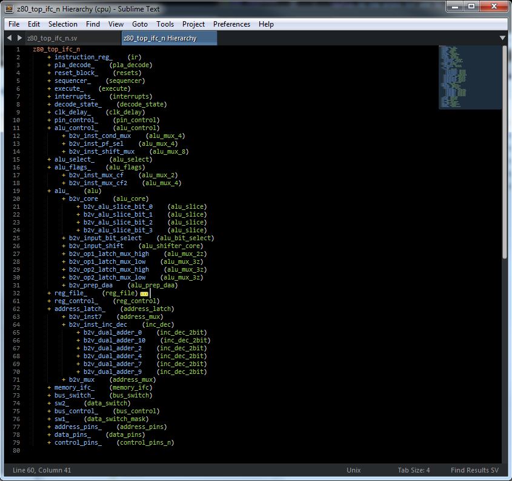

# Signal Navigation
There is a few functions available to help you navigate in your code when you are looking for information about a signal.

All these feature works in the same way: the signal name use will either be the text selected or if there is no connection the word currently under the cursor.

### Show declaration
This feature will display in a tooltip (ST3 v3072 minimum) or in the status bar (bottom of the screen) the declaration of the signal. This is configurable with the setting `sv.tooltip`.

In the keybinding file provided in this doc, the command is associated to *F10*

When using the tooltip feature you get not only the signal type, but in case of structure, enum or interface, you also get field information.
This works not only on signal but also on port binding, field member of an interface or a class, a function ...

Here is the list of configuration parameter for the tooltip:

 - `sv.tooltip` : Boolean to enable tooltip (default true). When set to false the status bar is used instead.
 - `sv.tooltip_hide_on_move` : Hide the tooltip when the mouse move away from the tooltip (default true)
 - `sv.hover_max_size` : Max size of the file (in byte) to display popup info automatically when the mouse hover a valid symbol (module, signal, class, ...). Set to -1 (default) to disable the limit (default), 0 to disable feature.
 - `sv.tooltip_show_module_on_port` : True to include module type and instance when showing tooltip for a port. Default to false.
 - `sv.tooltip_show_refs` : True to show reference to module/interface/... Default to true.
 - `sv.tooltip_show_signal_links` : True to show links to driver/reference for signals. Default to false.

### Goto declaration
This features will move the cursor to the declaration of the signal.

In the keybinding file provided in this doc, the command is associated to *shift+F12*

### Goto driver
This features will move the cursor to the driver of the signal: this can be the declaration of the signal if this an input of the module, an assignment or the connection to the output of a module.

Note that this feature support the use of .*

In the keybinding file provided in this doc, the command is associated to *ctrl+F12*

### Example

<video controls>
  <source src="../images/navigation.webm" type="video/webm">
Your browser does not support the video tag.
</video>

---
# Show Hierarchy
This function will open a new buffer displaying the complete hierarchy of the curent module and all its sub-module.

This is available from the palette under the name "Verilog: Show Hierarchy".

The corresponding Sublime command (for keybinding or use in your own plugin) is `verilog_show_hierarchy`

Here is an example done at the top level of the opencore project A-Z80 CPU:

On the left you get the instances name, while on the right you get the instance type. Note that you can use the goto symbol (f12) on either word to go directly to the instance or the definition.

---
# Find Instances
This function will open a new buffer displaying in which file current module (either word selected or the module defined in current file) is instantiated and with which instance name.
A double click allows to go directly to the instance.

This is available from the palette under the name "Verilog: Find Instance".

The corresponding Sublime command (for keybinding or use in your own plugin) is `verilog_find_instance`

Here is an example done on one submodule of the opencore project A-Z80 CPU:

---
# Move/Select block
This function is similar to the move to bracket feature of sublimeText (shift+m/ctrl+shift+m) but works with most systemVerilog block like begin/end, module/endmodule, ...

The corresponding Sublime command (for keybinding or use in your own plugin) is `verilog_goto_block_boundary`.
It takes one string argument cmd which can be "move" or "select".

<video controls>
  <source src="../images/block_selection.webm" type="video/webm">
Your browser does not support the video tag.
</video>